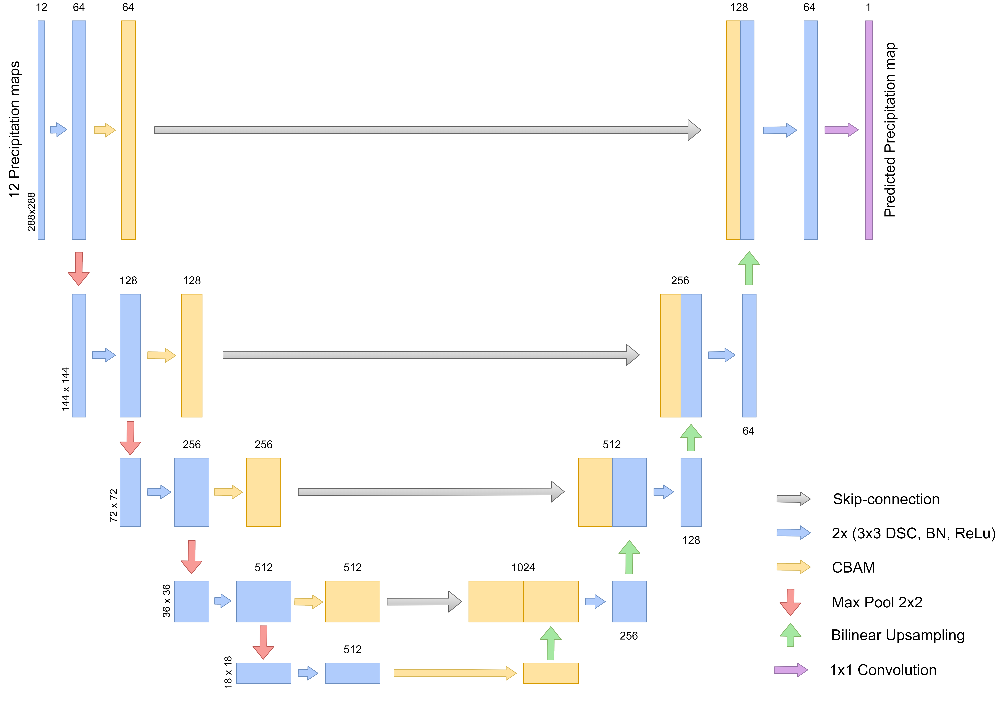

# SmaAt-UNet
Code for the Paper "SmaAt-UNet: Precipitation Nowcasting using a Small Attention-UNet Architecture" [Arxiv-link](https://arxiv.org/abs/2007.04417), [Elsevier-link](https://www.sciencedirect.com/science/article/pii/S0167865521000556?via%3Dihub)



The proposed SmaAt-UNet can be found in the model-folder under [SmaAt_UNet](models/SmaAt_UNet.py).

---
For the paper we used the [Pytorch-Lightning](https://github.com/PyTorchLightning/pytorch-lightning) -module (PL) which simplifies the training process and allows easy additions of loggers and checkpoint creations.
In order to use PL we created the model [UNetDS_Attention](models/unet_precip_regression_lightning.py) whose parent inherits from the pl.LightningModule. This model is the same as the pure PyTorch SmaAt-UNet implementation with the added PL functions.

### Training
An example [training script](train_SmaAtUNet.py) is given for a classification task (PascalVOC).

For training on the precipitation task we used the [train_precip_lightning.py](train_precip_lightning.py) file. 

### Precipitation dataset
The dataset consists of precipitation maps in 5-minute intervals from 2016-2019 resulting in about 420,000 images.

The dataset is based on radar precipitation maps from the [The Royal Netherlands Meteorological Institute (KNMI)](https://www.knmi.nl/over-het-knmi/about).
The original images were cropped as can be seen in the example below:


If you are interested in the dataset that we used please write an e-mail to: k.trebing@alumni.maastrichtuniversity.nl and s.mehrkanoon@uu.nl

The 50% dataset has 4GB in size and the 20% dataset has 16.5GB in size. Use the [create_dataset.py](create_datasets.py) to create the two datasets used from the original dataset.

The dataset is already normalized using a [Min-Max normalization](https://en.wikipedia.org/wiki/Feature_scaling#Rescaling_(min-max_normalization)). In order to revert this you need to multiply the images by 47.83; this results in the images showing the mm/5min.
### Citation   
```
@article{TREBING2021,
title = {SmaAt-UNet: Precipitation Nowcasting using a Small Attention-UNet Architecture},
journal = {Pattern Recognition Letters},
year = {2021},
issn = {0167-8655},
doi = {https://doi.org/10.1016/j.patrec.2021.01.036},
url = {https://www.sciencedirect.com/science/article/pii/S0167865521000556},
author = {Kevin Trebing and Tomasz Staǹczyk and Siamak Mehrkanoon},
keywords = {Domain adaptation, neural networks, kernel methods, coupling regularization},
abstract = {Weather forecasting is dominated by numerical weather prediction that tries to model accurately the physical properties of the atmosphere. A downside of numerical weather prediction is that it is lacking the ability for short-term forecasts using the latest available information. By using a data-driven neural network approach we show that it is possible to produce an accurate precipitation nowcast. To this end, we propose SmaAt-UNet, an efficient convolutional neural networks-based on the well known UNet architecture equipped with attention modules and depthwise-separable convolutions. We evaluate our approaches on a real-life datasets using precipitation maps from the region of the Netherlands and binary images of cloud coverage of France. The experimental results show that in terms of prediction performance, the proposed model is comparable to other examined models while only using a quarter of the trainable parameters.}
}
```   
